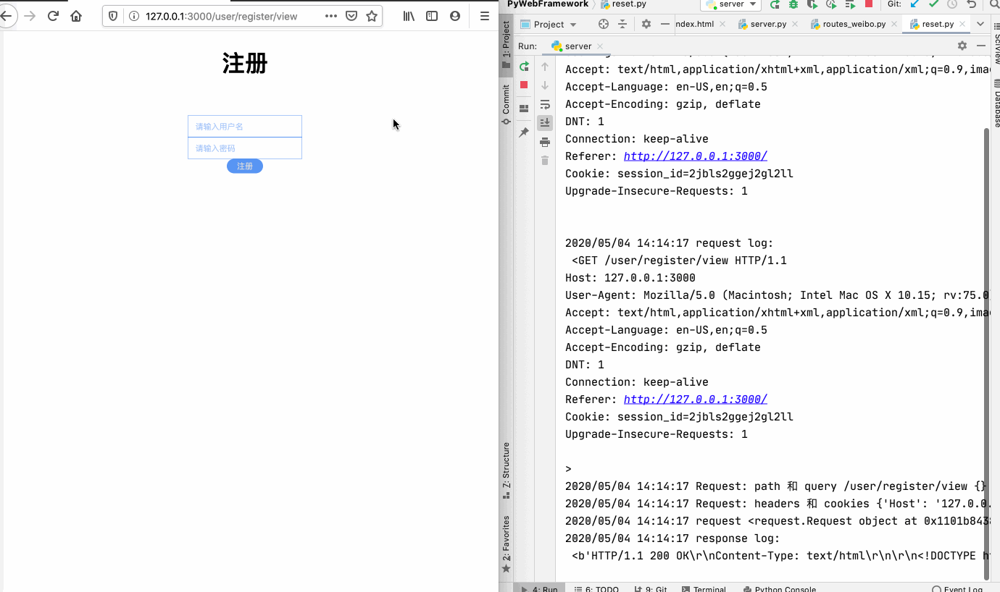
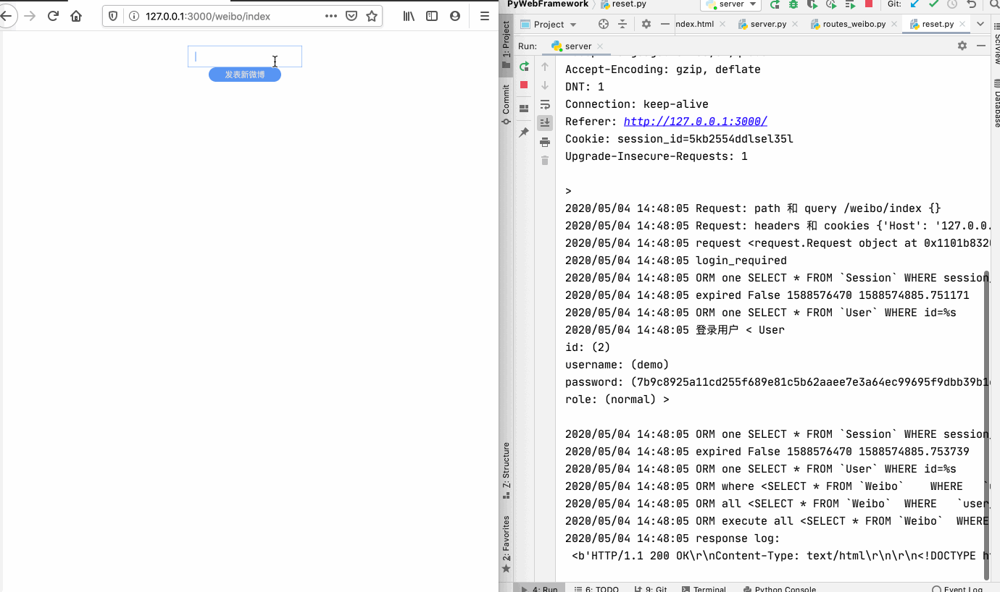

# 一个基于 Socket 及 HTTP 的 MVC Web 框架

## 介绍

- 实现了基于 TCP Socket 通信, HTTP 协议解析, 多线程的 Web Server
- 基于 MVC 架构的 Web 框架, 使用 Jinja2 模板构建动态页面, 数据与视图解耦
- 包含不同 url 的路由分发, Cookie 数据保存, 服务端 Session 实现
- 基于 Session 的用户会话实现, 权限认证, CSRF 防御, 密码加盐保存
- 实现基于 MySQL 的 ORM 框架, 支持基本 CRUD 功能, 及高级的 join, union, 子查询, 事务; 避免了 n + 1 问题, 拥有更好的性能
- 使用框架实现了 Todolist 及 Weibo 应用, 包含注册、登录, 微博、评论、TODO 的添加、编辑、删除

## 使用

修改 config.py 中数据库及 secret.py 数据库密码  
```bash
git clone https://github.com/typerix/web-frame.git
cd web-frame
pip install pymysql jinja2
python reset.py
python server.py
```
浏览器访问 http://localhost:3000/  
用户名: guest, 密码: 123  

## Demo

**请求以及响应报文解析，登录注册， Todo 演示**




**发表、评论、修改、删除 weibo**

